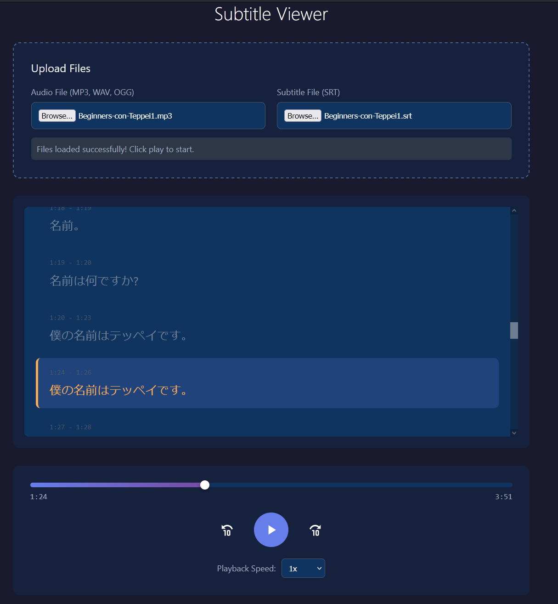

# Subtitle Viewer

A locally hosted web app for language learning that syncs audio playback with subtitle display.



## Features

- Upload audio files (MP3, WAV, OGG) and subtitle files (SRT)
- Play/pause/scrub audio with a progress bar
- View all subtitles at once with the current sentence highlighted
- Auto-scroll to keep the current subtitle in view
- Click any subtitle line to jump to that timestamp
- Playback speed control (0.5x - 2x)
- Keyboard shortcuts: Space (play/pause), Arrow keys (skip 5s)

## Usage

### Option 1: Python (recommended)

```bash
python3 serve.py
```

This will start a local server and open your browser automatically.

### Option 2: Any HTTP server

```bash
# Python
python3 -m http.server 8000

# Node.js
npx serve

# PHP
php -S localhost:8000
```

Then open `http://localhost:8000` in your browser.

### Option 3: Direct file opening

Simply open `index.html` directly in your browser (some browsers may restrict file access).

## Example Files

From: https://nihongoconteppei.com
Teppei-sensei's courses are very useful and I created this app to help me learn faster with them!

The repository includes example files to test the app:
- `example.mp3` - Japanese language learning podcast
- `example.srt` - Corresponding subtitles
